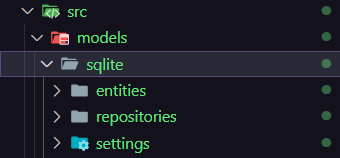
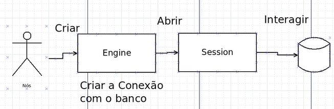

# Sumário
[Primeiras Configurações](#Primeiras-Configurações)
[Pasta Models](#Pasta-Models)

# Primeiras Configurações
1. Criar um arquivo **storage.db** para seu banco de dados.

2. Instalar **SQLAlchemy**:
*Uma ORM (Object-Relational Mapping) permite que você manipule tabelas e dados no banco como se fossem objetos e classes, abstraindo o uso de comandos SQL.*
```bash
pip install SQLAlchemy
```
3. Com o **Dbeaver** ( ou outro ) criar um banco SQLite:
3.1:
*Nesse caminho, iremos escolher o arquivo **storage.bd** criado antes.*

4. Criar uma pasta init para colocar configurações do projeto, exemplo: **schema.sql** para as colocar o script que inicia suas tabelas ou até mesmo sobre containers de docker.

## Exemplo de arquivo schema.sql:
```python
CREATE TABLE IF NOT EXISTS users (
    id INTEGER PRIMARY KEY AUTOINCREMENT,
    name TEXT NOT NULL,
    username TEXT NOT NULL,
    password TEXT NOT NULL
);

CREATE TABLE IF NOT EXISTS requests (
    id INTEGER PRIMARY KEY AUTOINCREMENT,
    description TEXT,
    created_at TEXT,
    user_id INTEGER NOT NULL,
    FOREIGN KEY (user_id) REFERENCES users(id)
);

INSERT INTO users (name, username, password)
VALUES
    ('John Doe', 'johndoe', '123456'),
    ('Jane Doe', 'janedoe', '123456');

INSERT INTO requests (description, created_at, user_id)
VALUES
    ('Request 1', '2021-01-01 00:00:00', 1),
    ('Request 2', '2021-01-02 00:00:00', 1),
    ('Request 3', '2021-01-03 00:00:00', 2),
    ('Request 4', '2021-01-04 00:00:00', 2);
```

**Jogar o script no Dbeaver ou outro software**
*Terminaremos as configurações do BD na pasta Models.*

# Pasta Models
*Primeiramente criamos uma pasta SRC onde ficará todo o projeto praticamente. Dentro dela, temos a pasta MODELS e faremos algumas pastas para separarmos as responsabilidades do banco de dados:*



**Primeiramente iremos criar a Engine do nosso BD em um arquivo connection.py que ficará nas settings.**


## Settings
Definir conexões e afim

### Arquivo connection:
```python
from sqlalchemy import create_engine

class DbConnectionHandler:
    def __init__(self):
        self.__connection_string = 'sqlite:///storage.db' # Se fosse um banco de dados MySQL, por exemplo, seria mysql://... e storage.db seria o nome do banco de dados que temos até o arquivo dele.
        self.__engine = None

    def connect_to_db(self):
        self.__engine = create_engine(self.__connection_string)

    def get_engine(self):
        return self.__engine

db_connection_handler = DbConnectionHandler()
```
### Testar a conexão
**Usaremos o Pytest:**
```bash
pip install -U pytest
```

```python

```
**Código de  teste de integração:**
```python
import pytest
from sqlalchemy.engine import Engine
from .connection import db_connection_handler

# Teste de integração

@pytest.mark.skip(reason="Interacts with the database")
def test_connection():

    assert db_connection_handler.get_engine() is  None   

    db_connection_handler.connect_to_db()
    engine = db_connection_handler.get_engine()

    assert engine is not None
    assert isinstance(engine, Engine)
```

### Como o SQLAlchemy sabe as tabelas?
**Criando um declarative base:**

```python
from sqlalchemy.orm import declarative_base

Base = declarative_base()
```

## Entities
Espelhamento do BD.
**No arquivo schema.sql temos**:
```sql
CREATE TABLE IF NOT EXISTS users (
    id INTEGER PRIMARY KEY AUTOINCREMENT,
    name TEXT NOT NULL,
    username TEXT NOT NULL,
    password TEXT NOT NULL
);
```
**Fazemos um *espelhamento* no entities, veja:**
### users.py
```python
from sqlalchemy import BIGINT, Column, String
from src.models.sqlite.settings.base import Base

class UsersTable(Base):

    __tablename__ = 'users'
    id = Column(BIGINT, primary_key=True)
    name = Column(String, nullable=False)
    username = Column(String, nullable=False, unique=True)
    password = Column(String, nullable=False)

    def __repr__(self):
        return f"Users: [id: {self.id}, name: {self.name}, username: {self.username}]"
```
*Fazemos isso com as demais tabelas*

## Repositories
Ações feitas no BD.

