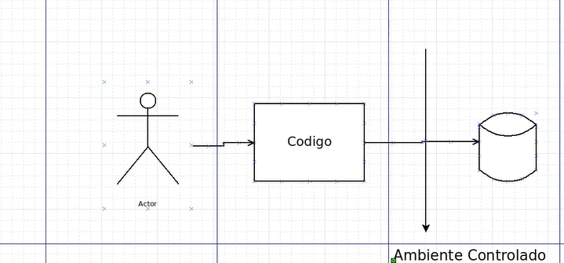

# Introdução
Esse arquivo  contém exemplos de repositório e também uma bo visão na parte de Mocks para fazer testes. Mais exemplos de Mock [aqui](https://github.com/artfrc/Python-anotacoes/tree/main/4.%20Mocks)

# Repositories
Ações feitas no BD.from sqlalchemy import create_engine

## Exemplo de repositório:

```python
from typing import List
from sqlalchemy.orm.exc import NoResultFound
from src.models.sqlite.entities.users import UsersTable

class UserRepository:
    def __init__(self, db_connection):
        self.__db_connection = db_connection

    def list_users(self) -> List[UsersTable]:
        # No with entramos na função __enter__ do objeto self.__db_connection e o retorno é atribuído a variável database
        with self.__db_connection as database:
            try:
                users = database.session.query(UsersTable).all()
                return users
            except NoResultFound:
                return []
            
    def delete_user(self, user_id: int):
        with self.__db_connection as database:
            try:
                (
                    database.session
                    .query(UsersTable)
                    .filter(UsersTable.id == user_id)
                    .delete()
                )
                database.session.commit()            
            except Exception as exception:
                database.session.rollback()
                raise exception
```
Claro que implementa as demais ações no banco.

## Exemplo teste de integração:
```python
import pytest
from src.models.sqlite.settings.connection import db_connection_handler
from .users_repository import UserRepository

db_connection_handler.connect_to_db()

@pytest.mark.skip(reason="Interacts with the database")
def test_list_users():
    repo = UserRepository(db_connection_handler)
    response = repo.list_users()

    response_expected = [
        {"id": 1, "name": "John Doe", "username": "johndoe"},
        {"id": 2, "name": "Jane Doe", "username": "janedoe"},
    ]

    response_as_dict = [
        {"id": user.id, "name": user.name, "username": user.username}
        for user in response
    ]

    assert response_as_dict == response_expected
```
### Testes unitários

Antes interagíamos com o banco, agora iremos fazer um amboente controlado para testarmos isoladamente uma parte do código. Veja:

**Utilizaremos mock-alchemy:**
```bash
pip install mock-alchemy
```
Para fazermos esses testes, iremos precisar simular o comportamento do arquivo connection.py, pois em nosso repositório temos o banco sendo passaado por injeção de dependência. Logo, teremos um Mock da conexão. Ficará assim:

```python
from unittest import mock
from mock_alchemy.mocking import UnifiedAlchemyMagicMock
from src.models.sqlite.entities.users import UsersTable
from .users_repository import UserRepository

class MockConnection:

    def __init__(self):
        self.session = UnifiedAlchemyMagicMock(
            data = 
            [
                (
                    [mock.call.query(UsersTable)], # query
                    [UsersTable(id=1, name="John Doe", username="johndoe")] # resultado
                )
            ]
        )

    def __enter__(self):
        return self

    def __exit__(self, exc_type, exc_val, exc_tb):
        pass
```
Note que simulamos uma section e até o enter e o exit.

### Testes unitários (Exemplos):

```python
from unittest import mock
from mock_alchemy.mocking import UnifiedAlchemyMagicMock
from src.models.sqlite.entities.users import UsersTable
from .users_repository import UserRepository

class MockConnection:

    def __init__(self):
        self.session = UnifiedAlchemyMagicMock(
            data = 
            [
                (
                    [mock.call.query(UsersTable)],
                    [UsersTable(id=1, name="John Doe", username="johndoe")] 
                )
            ]
        )

    def __enter__(self):
        return self

    def __exit__(self, exc_type, exc_val, exc_tb):
        pass

def test_list_users():
    mock_connection = MockConnection()
    repo = UserRepository(mock_connection)
    response = repo.list_users()

    mock_connection.session.query.assert_called_once_with(UsersTable)
    mock_connection.session.all.assert_called_once_with()

    assert response[0].id == 1
    assert response[0].name == "John Doe"
    assert response[0].username == "johndoe"

def test_delete_user():
    mock_connection = MockConnection()
    repo = UserRepository(mock_connection)

    repo.delete_user(1)

    mock_connection.session.query.assert_called_once_with(UsersTable)
    mock_connection.session.filter.assert_called_once_with(UsersTable.id == 1)
    mock_connection.session.delete.assert_called_once_with()
    mock_connection.session.commit.assert_called_once_with()
```
*Veja que para deletar não verificamos a deleção de fato e sim somente o comportamento do delete*

### Testar as exceptions:

```python
import pytest
from unittest import mock
from mock_alchemy.mocking import UnifiedAlchemyMagicMock
from sqlalchemy.orm.exc import NoResultFound
from src.models.sqlite.entities.users import UsersTable
from .users_repository import UserRepository

class MockConnection:

    def __init__(self):
        self.session = UnifiedAlchemyMagicMock(
            data = 
            [
                (
                    [mock.call.query(UsersTable)],
                    [UsersTable(id=1, name="John Doe", username="johndoe")] 
                )
            ]
        )

    def __enter__(self):
        return self

    def __exit__(self, exc_type, exc_val, exc_tb):
        pass

class MockConnectionNoResult:

    def __init__(self):
        self.session = UnifiedAlchemyMagicMock()
        # Responsável por simular o lançamento de uma exception (o método raise_no_result_found)
        self.session.query.side_effect = self.__raise_no_result_found

    def __raise_no_result_found(self, *args, **kwargs): # recebe todos os argumentos e kwargs passados para o método query
        raise NoResultFound("No result found")

    def __enter__(self):
        return self

    def __exit__(self, exc_type, exc_val, exc_tb):
        pass

def test_list_users():
    mock_connection = MockConnection()
    repo = UserRepository(mock_connection)
    response = repo.list_users()

    mock_connection.session.query.assert_called_once_with(UsersTable)
    mock_connection.session.all.assert_called_once_with()

    assert response[0].id == 1
    assert response[0].name == "John Doe"
    assert response[0].username == "johndoe"

def test_list_users_no_result():
    mock_connection_no_result = MockConnectionNoResult()
    repo = UserRepository(mock_connection_no_result)
    response = repo.list_users()

    mock_connection_no_result.session.query.assert_called_once_with(UsersTable)
    mock_connection_no_result.session.all.assert_not_called()

    assert response == []

def test_delete_user():
    mock_connection = MockConnection()
    repo = UserRepository(mock_connection)

    repo.delete_user(1)

    mock_connection.session.query.assert_called_once_with(UsersTable)
    mock_connection.session.filter.assert_called_once_with(UsersTable.id == 1)
    mock_connection.session.delete.assert_called_once_with()
    mock_connection.session.commit.assert_called_once_with()

def test_delete_user_error():
    mock_connection_no_result = MockConnectionNoResult()
    repo = UserRepository(mock_connection_no_result)

    with pytest.raises(Exception):
        repo.delete_user(1)

    mock_connection_no_result.session.rollback.assert_called_once()
```
*Note que criamos outro Mock*
