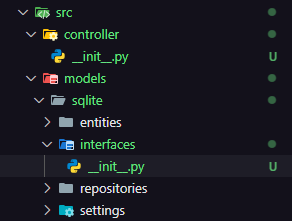
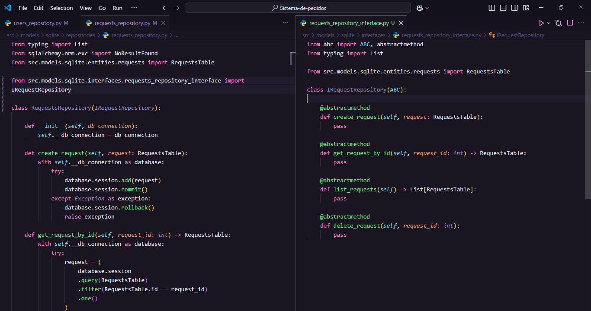

# Controllers
Parte do seu projeto onde fica a implementação das regras de negócio.
**Antes de continuarmos precisamos criar interfaces de nossos repositórios para acessarmos os métodos deles no controller. Sim, teremos o repositório como injeção de dependencia no controller.**


### Implementação da Interface


### Exemplo de implementação de um controller:
```python
import re # EXpressões regulares
from typing import Dict
from src.models.sqlite.interfaces.users_repository_interface import IUserRepository
from src.models.sqlite.entities.users import UsersTable

class UserCreatorController:
    def __init__(self, repository: IUserRepository):    
        self.__repository = repository

    def create_user(self, user_info: Dict) -> Dict:
        name = user_info["name"]
        username = user_info["username"]
        password = user_info["password"]

        self.__validate_name(name)
        self.__validate_username(username)
        user = UsersTable(name, username, password)
        self.__create_user_in_db(user)

        return self.__format_response(user)

    def __validate_name(self, name: str):

        no_valid_characters = re.compile(r"[^a-zA-Z ]") # Expressão que aceita apenas letras e espaços

        if no_valid_characters.search(name):
            raise Exception("Invalid name")
        
    def __validate_username(self, username: str):
        
        no_valid_characters = re.compile(r"[^a-zA-Z0-9]") # Expressão que aceita apenas letras e números

        if no_valid_characters.search(username):
            raise Exception("Invalid username")
        
    def __create_user_in_db(self, user: UsersTable):
        self.__repository.create_user(user)

    def __format_response(self, user: UsersTable) -> Dict:
        return {
            "data": {
                "type": "User",
                "count": 1,
                "attributes": {
                    "id": user.id,
                    "name": user.name,
                    "username": user.username
                }
            }
        }
```

### Teste unitário do controller:

```python
from src.models.sqlite.entities.users import UsersTable
from .user_creator_controller import UserCreatorController


class MockRepository:
    def create_user(self, user: UsersTable):
        pass

def test_create_user():
    user = {
        "name": "John Doe",
        "username": "johndoe",
        "password": "123456"
    }
    controller = UserCreatorController(MockRepository())
    response = controller.create_user(user)

    assert response == {
        'data': {
            'type': 'User', 
            'count': 1, 
            'attributes': {
                'id': None,7 
                'name': 'John Doe', 
                'username': 'johndoe'}
        }
    }
```

### Controller interessante
```python
import re
from src.models.sqlite.interfaces.users_repository_interface import IUserRepository

class UserDeleterController:
    def __init__(self, repository: IUserRepository):
        self.__repository = repository

    def delete_user(self, user_id: int):
        self.__validate_user_id(user_id)
        self.__delete_user_in_db(user_id)

    def __validate_user_id(self, user_id: int) -> None:
        
            no_valid_characters = re.compile(r"[^0-9]") # Expressão que aceita apenas números") 

            if no_valid_characters.search(str(user_id)):
                raise Exception("Invalid user_id")
            
    def __delete_user_in_db(self, user_id: int):
         self.__repository.delete_user(user_id)
```

### Método do teste:
```python
from .user_deleter_controller import UserDeleterController

def test_delete_user(mocker):
    repository = mocker.Mock()
    controller = UserDeleterController(repository)
    controller.delete_user(1)

    repository.delete_user.assert_called_once_with(1)
```