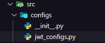

# Segurança
Biblioteca necessária:
```bash
pip install bcrypt
```

# Sumário
- [Arquitetura](#Arquitetura)
- [Padrão fachada](#Padrão-fachada)
- [Variáveis de ambiente](#Variáveis-de-ambiente)

## Arquitetura
Seguindo boas práticas de arquitetura teremos uma pasta separada para trabalharmos com todas as bibliotecas externas:


## Padrão fachada
_Irá implementar apenas os métodos que irei utilizar dessa biblioteca._


## Padrão fachada para o bcrypt
```python
import bcrypt

class PasswordHandler:
    def encrypt_password(self, password: str) -> str:
        salt = bcrypt.gensalt() # gera algo aleatório
        # gera a senha encriptada utilizando o salt
        hashed_password = bcrypt.hashpw(password.encode('utf-8'), salt)

        return hashed_password
    
    # checa se a senha bate com a senha encriptada
    def check_password(self, password: str, hashed_password: str) -> bool:
        return bcrypt.checkpw(password.encode('utf-8'), hashed_password)
```

### Teste de integração dessa fachada
```python
from .password_handler import PasswordHandler

def test_encrypt():
    my_pass = "123Rocket"
    password_handler = PasswordHandler()
    hashed_password = password_handler.encrypt_password(my_pass)

    pass_checked = password_handler.check_password(my_pass, hashed_password)

    assert pass_checked
```

## Padrão fachada para o jwt
```python
from typing import Dict
from datetime import datetime, timedelta, timezone
import jwt

class JwtHandler:
    # criação de um token para o usuário
    def create_jwt_token(self, body: Dict = {}) -> str: 
        token = jwt.encode(
            payload={
                'exp': datetime.now(timezone.utc) + timedelta(minutes=1),
                **body # armazena todo conteúdo do outro dict aqui
            },
            key='my_secret_key',
            algorithm='HS256'
        )

        return token
    
    def decode_jwt_token(self, token: str) -> Dict:
        token_info = jwt.decode(
            token,
            key='my_secret_key',
            algorithms=['HS256']
        )

        return token_info
```

### Teste de integração dessa fachada
```python
from .jwt_handler import JwtHandler

def test_jwt_handler():
    jwt_handler = JwtHandler()
    body = {
        "username": "test_user",
        "anything": "anything",
        "blablabla": ""
    }

    token = jwt_handler.create_jwt_token(body)
    info_token = jwt_handler.decode_jwt_token(token)

    assert token is not None
    assert isinstance(token, str)
    assert info_token['username'] == body['username']
```

## Variáveis de ambiente
_Informações que não devem ficar expostas vão aqui_

### Biblioteca
```bash
pip install python-dotenv
```

### Arquivo .env (Exemplo)
```python
KEY=MySecretKey
ALGORITHM=HS256
JWT_HOURS=10
```
### Pasta com configurações do projeto


**Esse arquivo init nela é especial, veja:**
```python
from dotenv import load_dotenv
load_dotenv()
```
**Configurações do jwt:**
```python
import os

jwt_infos = {
    "KEY": os.getenv("KEY"),
    "ALGORITHM": os.getenv("ALGORITHM"),
    "JWT_HOURS": os.getenv("JWT_HOURS")
}
```
*Com isso devemos tirar as informações do jwt_handler:*
```python
from typing import Dict
from datetime import datetime, timedelta, timezone
import jwt
from src.configs.jwt_configs import jwt_infos # importa as infos

class JwtHandler:
    def create_jwt_token(self, body: Dict = {}) -> str: #pylint: disable= W0102, dangerous-default-value
        token = jwt.encode(
            payload={
                'exp': datetime.now(timezone.utc) + timedelta(minutes=int(jwt_infos['JWT_HOURS'])),
                **body
            },
            key=jwt_infos['KEY'],
            algorithm=jwt_infos['ALGORITHM']
        )

        return token
    
    def decode_jwt_token(self, token: str) -> Dict:
        token_info = jwt.decode(
            token,
            key=jwt_infos['KEY'],
            algorithms=jwt_infos['ALGORITHM']
        )

        return token_info
```

