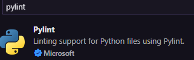
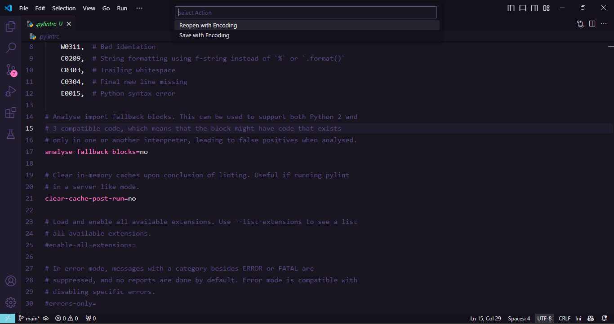

# Configuração de uma aplicação em Python

## ⚙️ Configuração do Ambiente

### 0. Arquivo .gitignore
```bash
**/__pycache__
.pytest_cache
venv
```

### 1. Criação e Ativação do Ambiente Virtual

1. **Instale o `virtualenv`**:
   ```bash
   pip install virtualenv

2. Crie o ambiente virtual:
   ```bash
   python -m venv venv
   
3. Ative o ambiente virtual (Windows):
   ```bash
   .\venv\Scripts\activate

4. Selecione o interpretador Python no VSCode (Pressione Ctrl + P):
   ```mathematica
   > Select Interpreter
- Escolha o ambiente virtual criado (venv).

---

## 2.🔍 Configuração do Pylint
### Pylint, fornece uma análise de código
1. Instalação
```bash
pip install pylint
```
2. Instalar extensão  no VsCode


3. Listar todas as bibliotecas instaladas no ambiente virtual em um arquivo **(para windows)**:
```bash
pip freeze > requirements.txt
```
3. Instalar todas as bibliotecas de uma vez:
```bash
pip install -r requirements.txt
```
---


## 3. Configurar Pylint para windows:

```bash
pylint --generate-rcfile > .pylintrc
```
### Mude para UTF-8:

- Save with Enconding
- Mude para UTF *sem* o BOM.

### Desativar algumas configurações chatas do pylint:
**No arquivo .pylintrc que criou anteriormente faça:**
```bash
[MAIN]

disable=
    C0114,  # Missing module docstring
    C0115,  # Missing class docstring
    C0116,  # Missing function or method docstring
    W0703,  # Catching too general exception
    W0311,  # Bad identation
    C0209,  # String formatting using f-string instead of `%` or `.format()`
    C0303,  # Trailing whitespace
    C0304,  # Final new line missing
    E0015,  # Python syntax error
```
### Testar o Pylint:
```bash
pylint "nome seu arquivo python"
```

---

## 3. Pre-commit

### 1. Instalar
```bash
pip install pre-commit
```
### 2. Configuração pre-commit:
- criar arquivo **.pre-commit-config.yaml** e colocar:
```bash
repos:
  - repo: local
    hooks:
      - id: pylint
        name: pylint
        entry: pylint
        language: system  # Usar o pylint do sistema
        types: [python]
        args:
          - "--disable=R,C"  # Desativa categorias de mensagens específicas
          - "--rcfile=.pylintrc"  # Corrigido: arquivo de configuração do pylint
          - "--load-plugins=pylint.extensions.docparams"  # Carrega o plugin docparams
```
3. Rodar o comando:
```bash
pre-commit install
```
---
---
## 📂 Configuração do SQLite
1. Criar uma pasta init para colocar configurações do projeto, exemplo: **schema.sql** para as colocar o script que inicia suas tabelas.
2. Criar um arquivo **storage.db** para seu banco de dados (trabalhando com SQLite)
---
## 🐍 Configuração do Python
1. Criar uma pasta **.vscode** e dentro dela um arquivo **settings.json** com o seguinte código:
```bash
{
    "python.linting.enabled": true,
    "python.linting.pylintEnabled": true,
    "files.exclude": {
        "**/*.pyc": {"when": "$(basename).py"},
        "**/__pycache__": true,
        "**/*.pytest_cache": true,
    }
}
```
Basicamente ativa o liting do VsCode para Python e usa especificamente o PyLint para liting. Também adiciona alguns arquivos para não serem exibidos na árvore de renderização.
