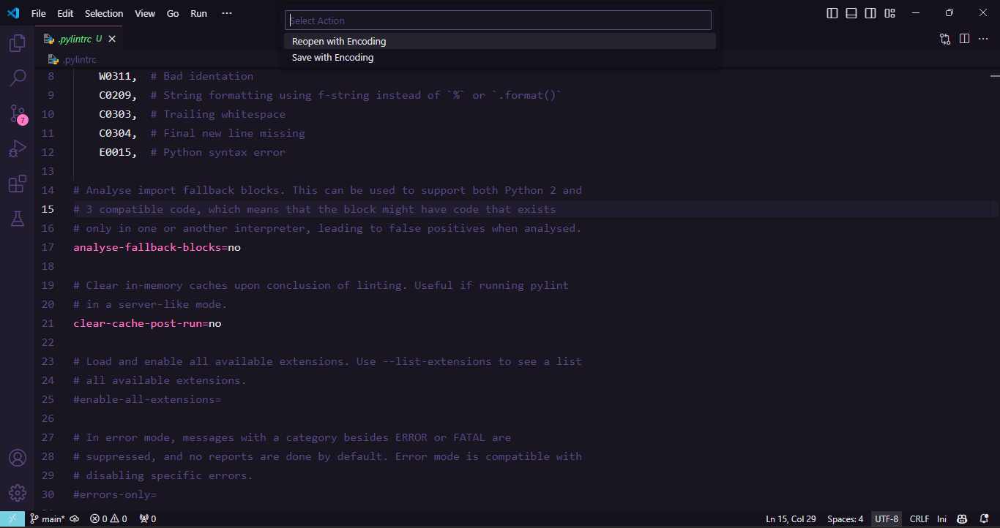
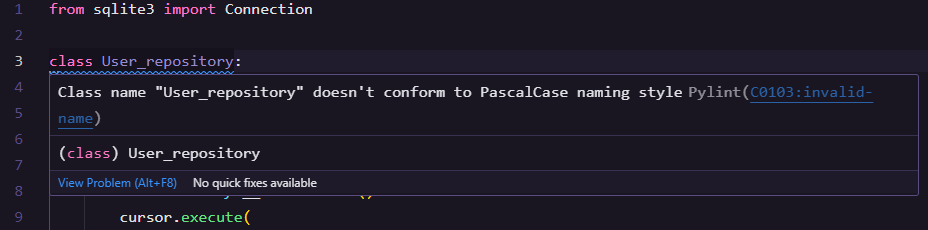
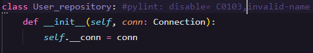

# Configurações iniciais de uma aplicação python

## Sumário
- [⚙️ Configuração do Ambiente](#️-configuração-do-ambiente)
  - [0. Arquivo .gitignore](#0-arquivo-gitignore)
  - [1. Criação e Ativação do Ambiente Virtual](#1-Criação-e-Ativação-do-Ambiente-Virtual)
  - [2. Configuração do Pylint](#2-Configuração-do-Pylint)
  - [3. Pre-commit](#3-Pre-commit)

- [🐍 Configuração do Python](#🐍-Configuração-do-Python)


# ⚙️ Configuração do Ambiente

## 0. Arquivo .gitignore
```bash
**/__pycache__
.pytest_cache
venv
```
---

## 1. Criação e Ativação do Ambiente Virtual

### 1.1 **Instale o `virtualenv`**:
```bash
pip install virtualenv
```

### 1.2. Crie o ambiente virtual:
```bash
python -m venv venv
``` 

### 1.3. Ative o ambiente virtual (Windows):
```bash
.\venv\Scripts\activate
```

### 1.4. Selecione o interpretador Python no VSCode (Pressione Ctrl + P):
```mathematica
> Select Interpreter
- Escolha o ambiente virtual criado (venv).
```

---

# 2. Configuração do Pylint
*Pylint, fornece uma análise de código para manter seu projeto com boas práticas, ou seja, organizado.*
## 2.1. Instalação
```
pip install pylint
```

## 2.2. Instalar extensão  no VsCode


## 2.3. Listar todas as bibliotecas instaladas no ambiente virtual em um arquivo **(para windows)**:
```bash
pip freeze > requirements.txt
```
## 2.4 Instalar todas as bibliotecas de uma vez:
```bash
pip install -r requirements.txt
```

# 2.5 Configurando Pylint para Windows:

```bash
pylint --generate-rcfile > .pylintrc
```
### *Mude para UTF-8 o arquivo .pylintrc:*

- Save with Enconding
- *Mude para UTF *sem* o BOM.*

### Desativar algumas configurações *chatas* do pylint:
**No arquivo *.pylintrc* que criou anteriormente faça:**
```bash
[MAIN]

disable=
    C0114,  # Missing module docstring
    C0115,  # Missing class docstring
    C0116,  # Missing function or method docstring
    W0703,  # Catching too general exception
    W0311,  # Bad identation
    C0209,  # String formatting using f-string instead of `%` or `.format()`
    C0303,  # Trailing whitespace
    C0304,  # Final new line missing
    E0015,  # Python syntax error
```
*Nota: é possível desativar algumas reclamações do pylint direto no arquivo se fizer sentido pra você. Veja:*


**C0103,invalid-name é o nome do erro que estava dando**
### Testar o Pylint:
```bash
pylint "nome seu arquivo python"
```

---

# 3. Pre-commit
*A junção do Pylint com o Pre-commit irá ajudar evitar fazer commits com códigos sem uma boa prática, pois antes do commit o pylint irá fazer uma análise do código, se estiver tudo ok, então o commit é realizado.*
## 3.1. Instalar
```bash
pip install pre-commit
```
## 3.2. Configuração pre-commit:
- criar arquivo **.pre-commit-config.yaml** e colocar:
```bash
repos:
  - repo: local
    hooks:
      - id: pylint
        name: pylint
        entry: pylint
        language: system  # Usar o pylint do sistema
        types: [python]
        args:
          - "--disable=R,C"  # Desativa categorias de mensagens específicas
          - "--rcfile=.pylintrc"  # Corrigido: arquivo de configuração do pylint
          - "--load-plugins=pylint.extensions.docparams"  # Carrega o plugin docparams
```
## 3.3. Rodar o comando:
```bash
pre-commit install
```

---

## 🐍 Configuração do Python
1. Criar uma pasta **.vscode** e dentro dela um arquivo **settings.json** com o seguinte código:
```json
{
    "python.linting.enabled": true,
    "python.linting.pylintEnabled": true,
    "files.exclude": {
        "**/*.pyc": {"when": "$(basename).py"},
        "**/__pycache__": true,
        "**/*.pytest_cache": true,
    }
}
```
*Basicamente ativa o liting do VsCode para Python e usa especificamente o PyLint para liting. Também adiciona alguns arquivos para não serem exibidos na árvore de renderização.*