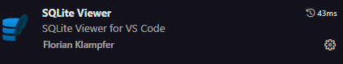

# 📂 Configuração do SQLite
1. Criar uma pasta init para colocar configurações do projeto, exemplo: **schema.sql** para as colocar o script que inicia suas tabelas ou até mesmo sobre containers de docker.
2. Criar um arquivo **storage.db** para seu banco de dados. Com esse arquivo você consegue ver os dados do seu banco no VsCode usando uma extensão:

---

# Utilização de uma ORM (SQLAlchemy)
*Uma ORM (Object-Relational Mapping) permite que você manipule tabelas e dados no banco como se fossem objetos e classes, abstraindo o uso de comandos SQL.*

## Instalação
```bash
pip install SQLAlchemy
```
---

## Gerente de banco de dados
*Opcionalmente, sugiro o Dbeaver.*

---

