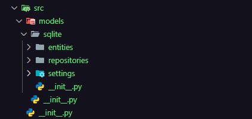

## Sumário
- [📂 Configuração do SQLite](#️📂-Configuração-do-SQLite)
- [Utilização de uma ORM (SQLAlchemy)](#Utilização-de-uma-ORM-(SQLAlchemy))
- [Pasta models](#Pasta-models)
- [Settings](#Settings)
- [Repositories](#Repositories)
- [Entities](#Entities)
- [Rotas](#Rotas)
- [Arquivo run (Incializar projeto)](#Arquivo-run-(Incializar-projeto))

# 📂 Configuração do SQLite
1. Criar uma pasta init para colocar configurações do projeto, exemplo: **schema.sql** para as colocar o script que inicia suas tabelas ou até mesmo sobre containers de docker.
2. Criar um arquivo **storage.db** para seu banco de dados. Com esse arquivo você consegue ver os dados do seu banco no VsCode usando uma extensão:

---

# Utilização de uma ORM (SQLAlchemy)
*Uma ORM (Object-Relational Mapping) permite que você manipule tabelas e dados no banco como se fossem objetos e classes, abstraindo o uso de comandos SQL.*

## Instalação
```bash
pip install SQLAlchemy
```
---

## Gerente de banco de dados
*Opcionalmente, sugiro o Dbeaver.*

---

# Pasta *models*
*Seguindo o padrão MVC, fazemos a seguinte estrutura:*

- Arquivos "init" são para facilitar na importações dos arquivos.
    - **settings** - Configurações de conexão
    - **entities** - espelhamento do banco
    - **repositories** - ações no banco

# Settings

## Arquivo de conexão
### Connection.py
* **duas abordagens**
### 1.
```python
from sqlalchemy import create_engine
from sqlalchemy.orm import sessionmaker

class DBConnectionHandler:
   def __init__(self):
      self.__connection_string = "sqlite:///storage.db"
      self.__engine = None
      self.session = None
      
   def connect_to_db(self):
      self.__engine = create_engine(self.__connection_string)
      
   def get_engine(self):
      return self.__engine
   
   def __enter__(self):
      session_maker = sessionmaker()
      self.session = session_maker(bind=self.__engine)
      return self
   
   def __exit__(self, exc_type, exc_val,  exc_tb):
      self.session.close()

db_connection_handler = DBConnectionHandler()
```
-  Usando SQLAlchemy, oferece uma abstração mais alta para interagir com bancos de dados relacionais, como SQLite, PostgreSQL, MySQL, etc. Ele permite que você trabalhe com objetos Python e faça consultas SQL de maneira mais Pythonica.
-  Usamos uma string de conexão no SQLAlchemy.
- O método create_engine é utilizado para criar uma "engine" de banco de dados, que é a principal forma de se conectar e interagir com o banco no SQLAlchemy. Ela lida com o gerenciamento de conexões e pode ser reutilizada para diversas transações.

### 2.
```python
import sqlite3
from sqlite3 import Connection

class __DBConnectionHandler: #pylint: disable = C0103, invalid-name
    def __init__(self):
        self.__connection_string = "storage.db"
        self.__conn = None

    def connect(self):
        self.__conn = sqlite3.connect(self.__connection_string)

    def get_connection(self) -> Connection:
        return self.__conn
    
db_connection_handler = __DBConnectionHandler()
```
-  Usa a biblioteca padrão sqlite3 do Python, que é uma forma mais direta e simples de se conectar ao banco de dados SQLite. Ela não oferece a abstração de ORM, o que significa que você precisará escrever consultas SQL diretamente e trabalhar com as respostas.

## Arquivo base.py (Abordagem 1)
```python
from sqlalchemy.orm import declarative_base

Base = declarative_base()
```
*Para o SQLAlchemy saber quais são os elementos de armazenamento*

---

# Entities
*No arquivo schema.sql tenho algo assim:*
```python
CREATE TABLE IF NOT EXISTS 'people' (
    id INTEGER PRIMARY KEY AUTOINCREMENT,
    first_name TEXT NOT NULL,
    last_name TEXT NOT NULL,
    age INTEGER NOT NULL,
    pet_id INTEGER NOT NULL,
    FOREIGN KEY (pet_id) REFERENCES pets(id)
);
```
*Na pasta entities terei uma entidade (people.py) assim:*
```python
from sqlalchemy import Column, ForeignKey, String, BIGINT
from src.models.sqlite.settings.base import Base

class PeopleTable(Base):
   __tablename__ = 'people'
   
   id = Column(BIGINT, primary_key=True)
   first_name = Column(String, nullable= False)
   last_name = Column(String, nullable= False)
   age = Column(BIGINT, primary_key=True)
   pet_id = Column(BIGINT, ForeignKey('pets.id'))
      
   def __repr__(self):
      return f'People: \
               first_name= {self.first_name}, \
               last_name={self.last_name}, \
               age = {self.age}, \
               pet_id = {self.pet_id}'
```
**Note o BASE na entidade**

---

# Repositories (Abordagem 1)

## Exemplo(somente o início):

```python
from sqlalchemy.orm.exc import NoResultFound
from src.models.sqlite.entities.people import PeopleTable
from src.models.sqlite.entities.pets import PetsTable
from src.models.sqlite.interfaces.people_repository import PeopleRepositoryInterface

class PeopleRepository(PeopleRepositoryInterface):
   def __init__(self, db_connection):
      self.__db_connection = db_connection
   
   def insert_person(self, first_name: str, last_name: str, age: int, pet_id: int):
      with self.__db_connection as database:
         try:
            person_data = PeopleTable(
               first_name= first_name,
               last_name= last_name,
               age=age,
               pet_id= pet_id
            )
            database.session.add(person_data)
            database.session.commit()
         except Exception as exception:
            database.session.rollback()
            raise exception
```

# Repositories (Abordagem 2)

## Exemplo(somente o início):
```python
from sqlite3 import Connection

class UserRepository:
    def __init__(self, conn: Connection):
        self.__conn = conn

    def registry_user(self, username: str, password: str):
        cursor = self.__conn.cursor()
        cursor.execute(
            '''
                INSERT INTO users 
                (username, password, balance) 
                VALUES 
                    (?, ?, ?);
            ''',
            (username, password, 0)
        )
        self.__conn.commit()   
```

---

# Rotas

## Caminho:
src/main/server/routes

## Exemplo:
```python
from flask import Blueprint, jsonify
from src.views.http_types.http_request import HttpRequest
from src.main.composer.pet_lister_composer import pet_lister_composer
from src.main.composer.pet_deleter_composer import pet_deleter_composer

from src.errors.error_handle import handle_errors


pet_route_bp = Blueprint('pets_routes', __name__)

@pet_route_bp.route("/pets", methods=["GET"])
def list_pets():
    try:
        view = pet_lister_composer()
        http_request = HttpRequest()
        http_response = view.handle(http_request)
        
        return jsonify(http_response.body), http_response.status_code
    
    except Exception as error:
      http_response = handle_errors(error)
      return jsonify(http_response.body), http_response.status_code
```

## Cadastrar rotas EXEMPLO
```python
from flask import Flask
from flask_cors import CORS
from src.models.sqlite.settings.connection import db_connection_handler

#impotar blueprints
from src.main.server.routes.pets_routes import pet_route_bp
from src.main.server.routes.person_routes import person_route_bp

db_connection_handler.connect_to_db()  

app = Flask(__name__)
CORS(app)
app.register_blueprint(pet_route_bp)
app.register_blueprint(person_route_bp)
```

# Arquivo run (Incializar projeto)
```python
from src.main.server.server import app

if __name__ == "__main__":
    app.run(host="0.0.0.0", port=3000)
```