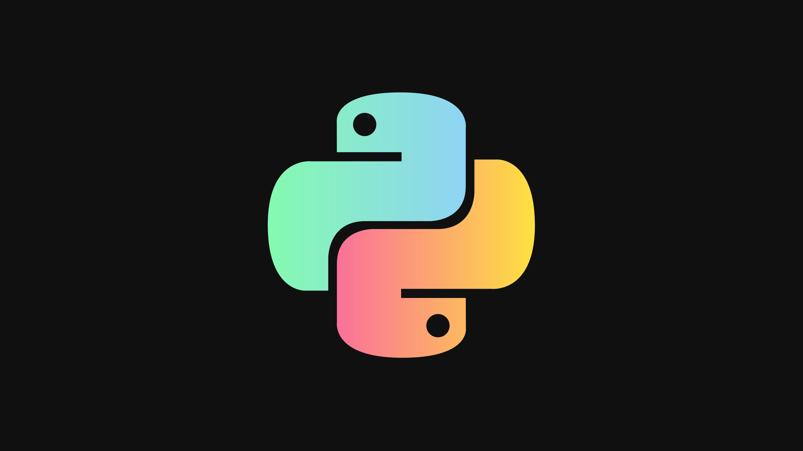

    

 

# Python anotações

Esta é minha base de consultas para coisas relacionadas a Python. Aqui armazeno explicações sobre meus estudos.

## 🚀 Projetos para se basear no código:
- [1. Introdução ao Python](https://github.com/artfrc/Introducao-Python)
- [2. Flask e Pytest](https://github.com/artfrc/Flask-e-Pytest)
    *  ***-Implementações com Flask e testes mais elaborados em projetos posteriores*** 
- [3. Arquitetura de Software e Padrão MVC](https://github.com/artfrc/Arq-Software-e-padrao-mvc/tree/main/Sistema%20adocao%20de%20pets)
- [4. Autenticação JWT e segurança](https://github.com/artfrc/Seguranca)

### Tecnologias:
* Flask
* BCrypt
* Pylint
* python-dotenv
* Pre-commit
* virtualenv

### Tópicos:

* Configuração do banco SQLite e do projeto _(mais simplificado)_
* Testes unitários e de integração
* Mocks
* Padrão fachada bcrypt e jwt
* Variáveis de ambiente
* Arquitetura MVC